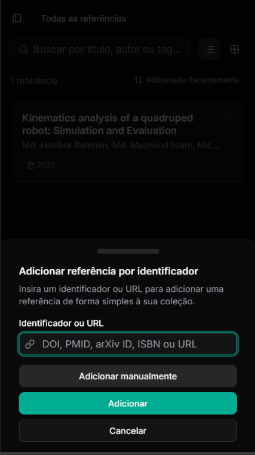
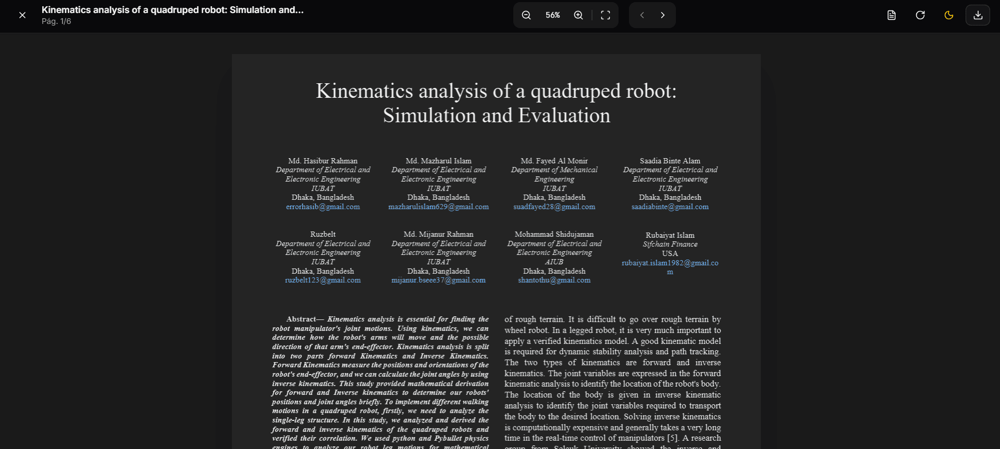
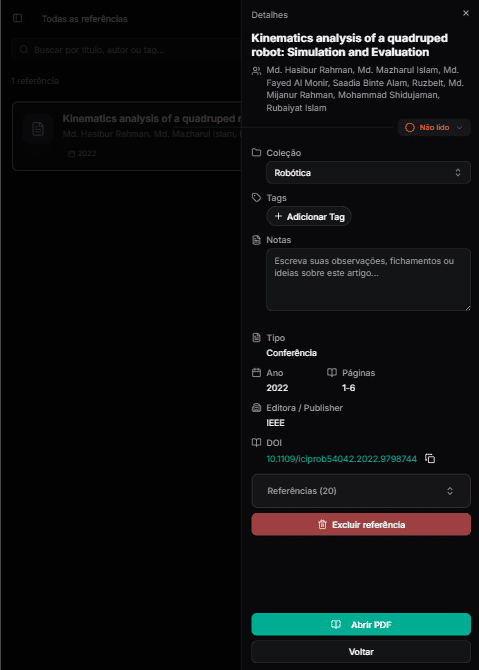

<div align="center">
  <a href="https://litdock.com">
    
  </a>

  <br />

  <h1>Litdock</h1>

  <p>
    <strong>O seu gerenciador de referências bibliográficas moderno, web-first e focado em UX.</strong>
  </p>

  <p>
    <a href="#-funcionalidades">Funcionalidades</a> •
    <a href="#-stack-tecnológico">Tech Stack</a> •
    <a href="#-como-rodar">Como Rodar</a> •
    <a href="#-configuração-do-supabase">Supabase</a> •
    <a href="#-contribuindo">Contribuindo</a>
  </p>

  
  
  
  
</div>

<br />

## 📖 Sobre o Projeto

**Litdock** é uma aplicação PWA (Progressive Web App) projetada para pesquisadores, estudantes e
acadêmicos que precisam organizar suas leituras sem a complexidade de softwares legados.

Diferente de gerenciadores tradicionais, o Litdock foca em uma interface limpa, captura automática
de metadados inteligente e uma experiência de leitura imersiva direto no navegador.

<a href="https://litdock.com">**> Live demo <**</a>

## ✨ Funcionalidades

### 📚 Gestão Inteligente

- **Auto-Importação:** Cole um DOI, ISBN, PMID ou link do ArXiv e o Litdock preenche tudo para você.
- **Detecção Inteligente:** Suporta inputs variados (URLs de PDF, IDs antigos do ArXiv, DOIs
  camuflados).
- **Organização Flexível:** Sistema robusto de **Coleções** (Pastas) e **Tags** coloridas.



### 📄 Leitor de PDF

- **Visualizador Nativo:** Leitor de PDF embutido de alta performance (baseado em PDF.js).
- **Foco Total:** Modo tela cheia que sobrepõe a interface para leitura sem distrações.
- **Dark Mode Real:** Inversão inteligente de cores para leitura noturna confortável em PDFs.
- **Zoom & Layout:** Suporte a scroll contínuo ou paginação slide-por-slide.



### 💾 Armazenamento Híbrido (Smart Storage)

Para contornar limites de armazenamento em nuvem e economizar dados:

- **Arquivos Pequenos (< 512KB):** Sincronizados na nuvem (Supabase Storage). Acessíveis em qualquer
  lugar.
- **Arquivos Grandes (> 512KB):** Salvos localmente no dispositivo (IndexedDB). Rápido e sem custo
  de banda.

### 📱 PWA & Mobile First

- **Responsivo:** Interface adaptável que fecha menus automaticamente e ajusta layouts.
- **Instalável:** Adicione à tela inicial do seu celular ou tablet como um app nativo.
- **Tema:** Suporte completo a **Light** e **Dark Mode** (persistente).



## 🛠 Stack Tecnológico

O projeto foi construído com as tecnologias mais modernas do ecossistema Vue:

- **Core:** [Vue 3](https://vuejs.org/) (Composition API) + [Vite](https://vitejs.dev/)
- **Linguagem:** [TypeScript](https://www.typescriptlang.org/)
- **Estado:** [Pinia](https://pinia.vuejs.org/) (Stores modulares)
- **UI/Estilo:** [Tailwind CSS](https://tailwindcss.com/) +
  [Shadcn-vue](https://www.shadcn-vue.com/)
- **Backend as a Service:** [Supabase](https://supabase.com/) (Auth, Database, Storage, Edge
  Functions)
- **Forms:** [Vee-Validate](https://vee-validate.logaretm.com/) + [Zod](https://zod.dev/)
- **Utilitários:** [VueUse](https://vueuse.org/) + [Lucide Icons](https://lucide.dev/)

## 🚀 Como Rodar

### Pré-requisitos

- Node.js 18+
- Conta no Supabase

### Passo a Passo

1. **Clone o repositório**
   ```bash
   git clone [https://github.com/seu-usuario/litdock.git](https://github.com/seu-usuario/litdock.git)
   cd litdock
   ```
2. **Instale as dependências**
   ```bash
   npm install
   ```
3. **Configure as Variáveis de Ambiente**

   ```bash
   # Crie um arquivo .env na raiz
   VITE_SUPABASE_URL=sua_url_do_supabase
   VITE_SUPABASE_ANON_KEY=sua_key_anonima
   ```

4. **Rode o servidor de desenvolvimento**
   ```bash
   npm run dev
   ```

## 🗄 Configuração do Supabase

Para que o projeto funcione, você precisa configurar o banco de dados.

### 1. Tabelas (SQL)

Execute o script de migração (disponível em `/supabase/schema.sql`) no SQL Editor do seu projeto
Supabase. Ele criará:

- `items`: Tabela principal com suporte a JSONB para metadados flexíveis.
- `tags` & `collections`: Organização.
- `item_tags`: Relacionamento N:N.

### 2. Storage

Crie um bucket chamado **`papers`**:

- **Privado** (Private bucket).
- **MIME Types:** `application/pdf`.
- **Policies (RLS):** Adicione as políticas para permitir que usuários autenticados façam CRUD
  apenas em seus próprios arquivos (pasta `user_id/*`).

### 3. Edge Function (Opcional)

Para importar metadados do ArXiv sem erros de CORS, faça deploy da função `arxiv-proxy` localizada
em `supabase/functions`.

## 🤝 Contribuindo

Contribuições são bem-vindas! Se você tem uma ideia de melhoria:

1. Faça um Fork do projeto.
2. Crie uma Branch para sua Feature (`git checkout -b feature/IncrívelFeature`).
3. Commit suas mudanças (`git commit -m 'Add some IncrívelFeature'`).
4. Push para a Branch (`git push origin feature/IncrívelFeature`).
5. Abra um Pull Request.

## 📄 Licença

Este projeto é distribuído sob a licença **Apache 2.0**.

Consulte o arquivo `LICENSE` para mais detalhes.

> **Nota sobre a Marca:** A licença Apache 2.0 concede o uso livre do código fonte, mas **NÃO
> concede permissão de uso da marca "Litdock"** ou do logotipo do projeto. Se você realizar um fork
> deste projeto para fins de distribuição, você deve alterar o nome e a identidade visual.

---

<div align="center">
Feito com 💜 por <a href="https://www.google.com/search?q=https://github.com/danielvitorsm">Daniel Moreira</a>
</div>
